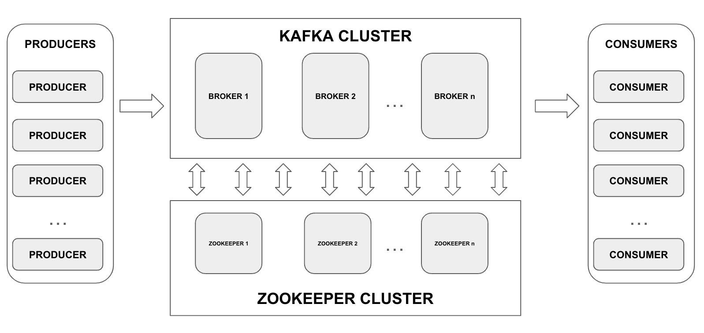
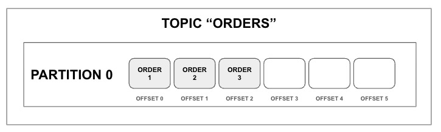
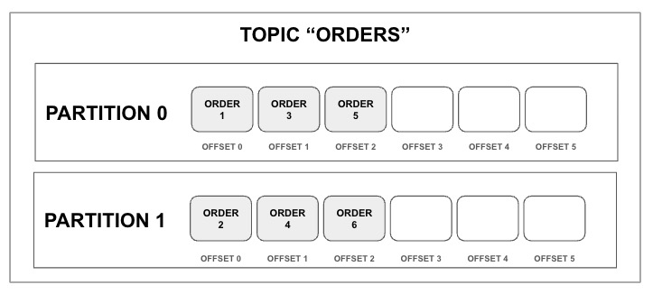

# INTRODUCTION

In this section we are going to see the main concepts of Kafka


## Architecture

In order to understand how Kafka works is important to know how its architecture is. The normal Kafka architecture is the following one:



We have a cluster of Kafka brokers and a cluster of Zookeeper servers. In a local environment, we need just one of them. Let's see how to install and start to work with Kafka:


### Install: official guide

Go to https://kafka.apache.org/quickstart

At the moment of this tutorial, the latest version is 3.6.0:

```shell
curl https://dlcdn.apache.org/kafka/3.6.0/kafka_2.13-3.6.0.tgz --output kafka_2.13-3.6.0.tgz
tar -xzf kafka_2.13-3.6.0.tgz
rm kafka_2.13-3.6.0.tgz
cd kafka_2.13-3.6.0
```


<br/>

To start the environment we are going to need two terminals:


- Terminal 1: from the folder "kafka_2.13-3.6.0"

```shell
bin/zookeeper-server-start.sh config/zookeeper.properties
```


- Terminal 2: Open a new terminal, go to the folder "kafka_2.13-3.6.0" and execute:

```shell
bin/kafka-server-start.sh config/server.properties
```

<br/>


### Zookeeper? Didn't it going to be removed?

<br/>

| Kafka 3.x can work without Zookeeper but is not production ready.<br />Zookeeper will be completely removed from Kafka with the release of Kafka 4.0 *(planned for April 2024)* |
| ------------------------------------------------------------ |

<br/>

Zookeeper is used to track cluster state, membership, and leadership. That means:

- Which brokers are part of the cluster
- Which broker is the leader of the different partitions
- Sending notifications to the Kafka cluster when something change in the cluster: new or deleted topics, brokers down, new broker added to cluster, etc...
- Storing configurations for topics
- Storing permissions


So, what happens if we have just one Zookeeper and it dies? It's easy. Our cluster dies too. For this reason, in a production environment, we should have more than one Zookeeper. It's recommended an odd number of Zookeeper servers (3, 5, 7...)


<br/>

## Topics

Topics is the key concept to organize messages in the Kafka world. A topic is a sequence of messages, like a log and it's identified by a name. Each message within a topic is associated to a concrete position, called offset.

Topics are divided in partitions. The minimum number of partitions is one. 

For instance, we can have the topic "Orders" in which we are going to produce new orders identified by an unique id. Let's see two possible scenarios:

- In the first one, we have configured just **<u>one partition</u>** in the topic:



​	In this topic, we can find the message associated to "order 1" in the offset 0, the one associated to "order 2" in the offset 1 and the one associated to 	the "order 3" in the offset 3. When a new message is produced and published to Kafka, it takes the latest offset of the unique partition


- In the second scenario, we are going to configure the topic "Orders" with **<u>two partitions</u>**:



​	In this case, we can find the orders associated to an odd number in the partition 0 and the orders associated to an even number in the partition 1. So, when a new order is published, the message will be stored in a different partition depending of the id of the order.


Why are we going to want to configure a topic with different partitions? The sort answer is scalability. Let's see it


